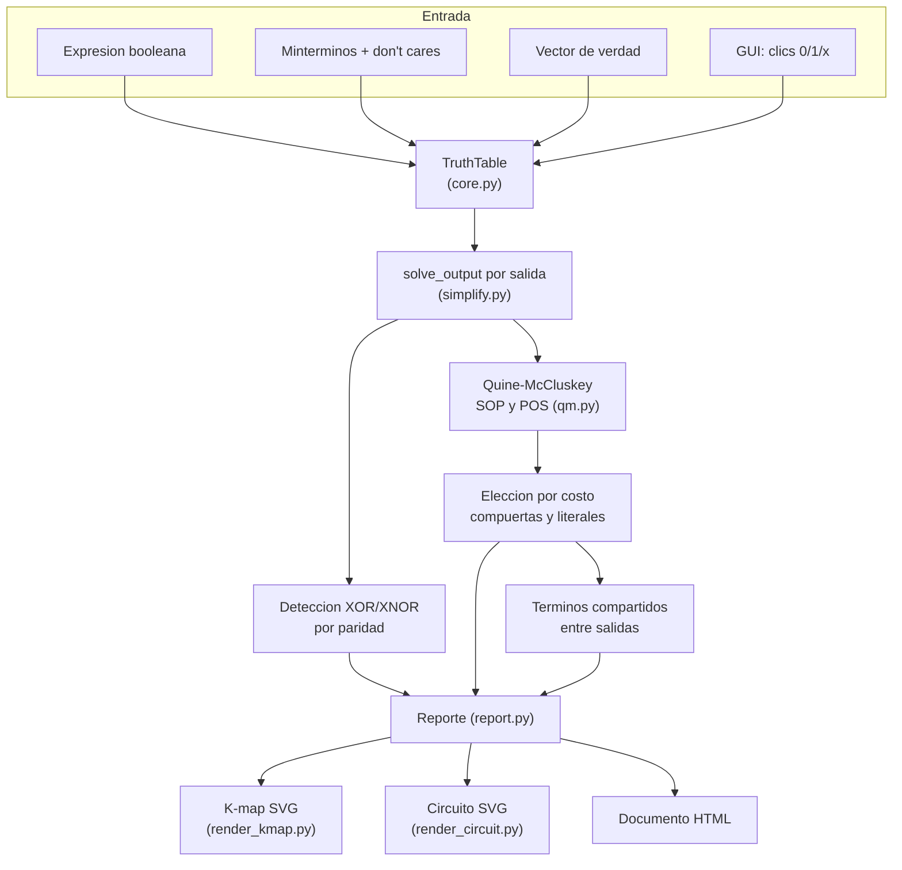
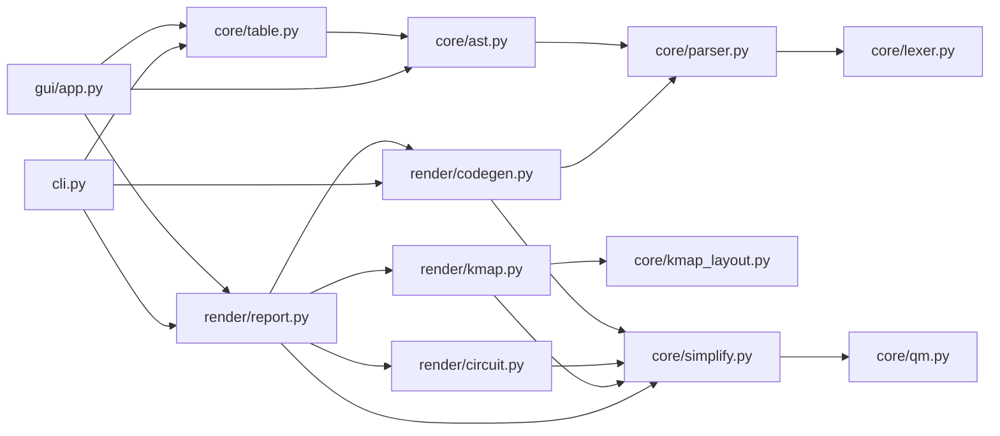
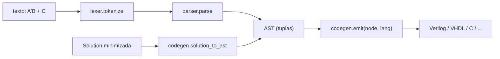
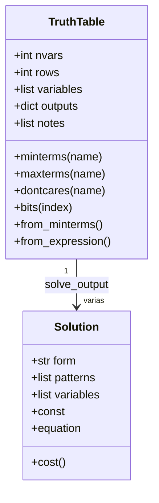
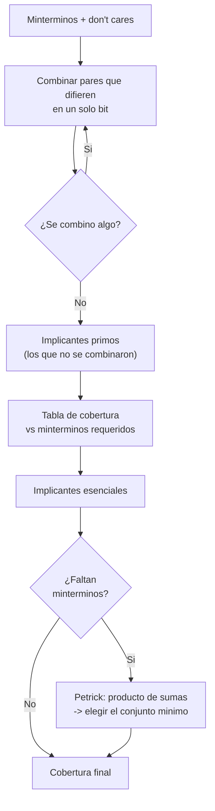
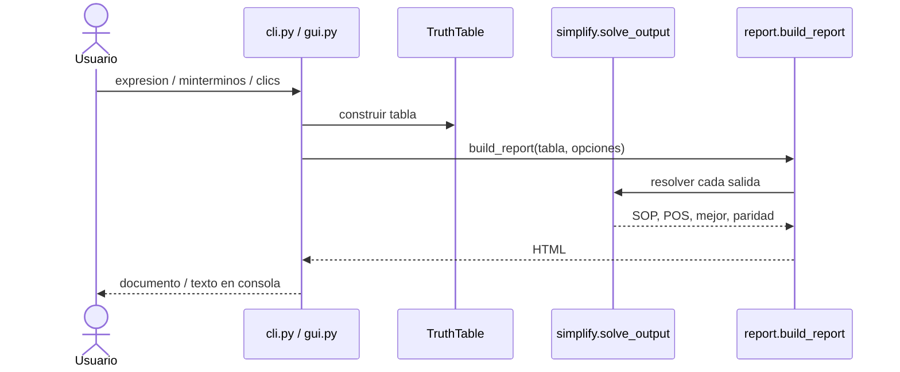

# Diseño de ktool

Este documento explica cómo está construida la herramienta por dentro: el flujo
general, los módulos, el modelo de datos y los algoritmos. La idea es que quien
quiera leer o modificar el código tenga un mapa antes de meterse a los archivos.

ktool es Python puro y no depende de librerías externas. La interfaz gráfica usa
`tkinter` (incluido con Python) y los mapas y circuitos se dibujan como SVG
escrito a mano, sin librerías de graficación.

---

## 1. Flujo general

Toda entrada termina convertida en una **tabla de verdad**. A partir de ahí cada
salida se resuelve por separado y los resultados se juntan en un documento.

Los dos puntos de entrada al programa son la **CLI** (`cli.py`) y la **GUI**
(`gui.py`). Ambas construyen una `TruthTable` y llaman al mismo motor, así que
producen resultados idénticos.

---

## 2. Módulos

Cada archivo tiene una responsabilidad y las dependencias van en un solo sentido
(los módulos de presentación dependen del núcleo, nunca al revés).

El paquete está en tres subpaquetes y las dependencias van en un solo sentido:
`gui`/`cli` → `render` → `core`. El núcleo no importa de presentación.

**Pipeline del traductor (Etapa B):** una sola fuente de verdad.
Texto o `Solution` → AST de tuplas → emisor por precedencia.

| Módulo | Responsabilidad |
| --- | --- |
| `core/table.py` | Tabla de verdad y parsing de bases numéricas. |
| `core/kmap_layout.py` | Geometría del K-map (código Gray, particiones). |
| `core/qm.py` | Quine-McCluskey: implicantes primos y cobertura mínima con Petrick. |
| `core/lexer.py` | Tokeniza la expresión booleana (scanner). |
| `core/parser.py` | Parser descendente recursivo → AST de tuplas. |
| `core/ast.py` | Gramática de nodos, `evaluate` sobre los 2^n casos, `build_output`. |
| `core/simplify.py` | Formato de ecuaciones, XOR/XNOR, costo y términos compartidos. |
| `render/kmap.py` | Dibuja el mapa de Karnaugh en SVG con los grupos circulados. |
| `render/circuit.py` | Dibuja el circuito en SVG (rieles de literales y compuertas). |
| `render/codegen.py` | Traductor AST → lenguaje (OPS por lenguaje + `emit` por precedencia). |
| `render/report.py` | Arma el documento HTML uniendo todo. |
| `cli.py` | Línea de comandos y switches (incluye `--to <lang>`). |
| `gui/app.py` | Interfaz gráfica en tkinter. |
| `gui/displays.py` | Displays insertables (7 segmentos / LED). |

---

## 3. Modelo de datos

`outputs` es un diccionario `nombre_de_salida -> lista de 2^n valores`, donde cada
valor es `0`, `1` o `"x"` (don't care). `solve_output` devuelve, por cada salida,
una `Solution` para SOP y otra para POS, más la recomendada y la forma XOR si
aplica.

Un **patrón** es una cadena como `"10-1"`: cada posición corresponde a una
variable, `1` y `0` son literales fijos y `-` es una variable eliminada del
término. De ahí salen tanto las ecuaciones como los grupos del mapa.

---

## 4. Quine-McCluskey

La minimización es el corazón de la herramienta. Es exacta (a diferencia de
agrupar a ojo en el mapa) y maneja don't cares.

Detalles que vale la pena conocer:

- Los **don't cares** entran en la fase de combinación (ayudan a formar grupos
  más grandes) pero **no** se exigen en la cobertura.
- El **POS** se calcula resolviendo el SOP de la función complementada (los ceros)
  y luego invirtiendo la polaridad de cada literal por De Morgan. Se reutiliza el
  mismo motor.
- **Petrick** se aplica solo cuando quedan minterminos sin cubrir después de los
  esenciales. Para 6 variables el tamaño es manejable; aun así se reduce por
  absorción para no explotar.

La elección entre SOP y POS compara el par `(compuertas, literales)` y se queda
con el menor. Por eso `auto` puede recomendar POS cuando sale más barato.

---

## 5. Layout del K-map

Las variables se reparten entre filas y columnas, y dentro de cada eje el orden
es **código Gray** (un solo bit cambia entre celdas vecinas), que es lo que hace
que los grupos queden contiguos.

| Variables | Filas | Columnas | Tamaño |
| --- | --- | --- | --- |
| 2 | A | B | 2 x 2 |
| 3 | A | B C | 2 x 4 |
| 4 | A B | C D | 4 x 4 |
| 5 | A B | C D E | 4 x 8 |
| 6 | A B C | D E F | 8 x 8 |

Para circular un grupo, se calcula qué filas y qué columnas casan con el patrón;
como el mapa es un toroide, un grupo que cruza el borde se dibuja como dos
rectángulos. Cada grupo recibe un color y un pequeño desfase para que se
distingan cuando se traslapan.

---

## 6. CLI contra GUI

La diferencia entre ambas es solo la captura de la entrada y las opciones de
formato. El núcleo (`core`, `qm`, `simplify`) no sabe si lo llamó la terminal o
la ventana.

---

## 7. Empaquetado

- `pyproject.toml` define los comandos `kmap` y `ktool` (entry points).
- `ktool_launcher.py` es el punto de entrada que usa PyInstaller para generar un
  ejecutable único.
- `installer/ktool.iss` (Inno Setup) toma ese ejecutable y arma el instalador que
  lo agrega al `PATH`.
- El flujo de GitHub Actions en `.github/workflows/release.yml` construye el
  ejecutable y el instalador automáticamente cuando se publica una etiqueta `v*`.
